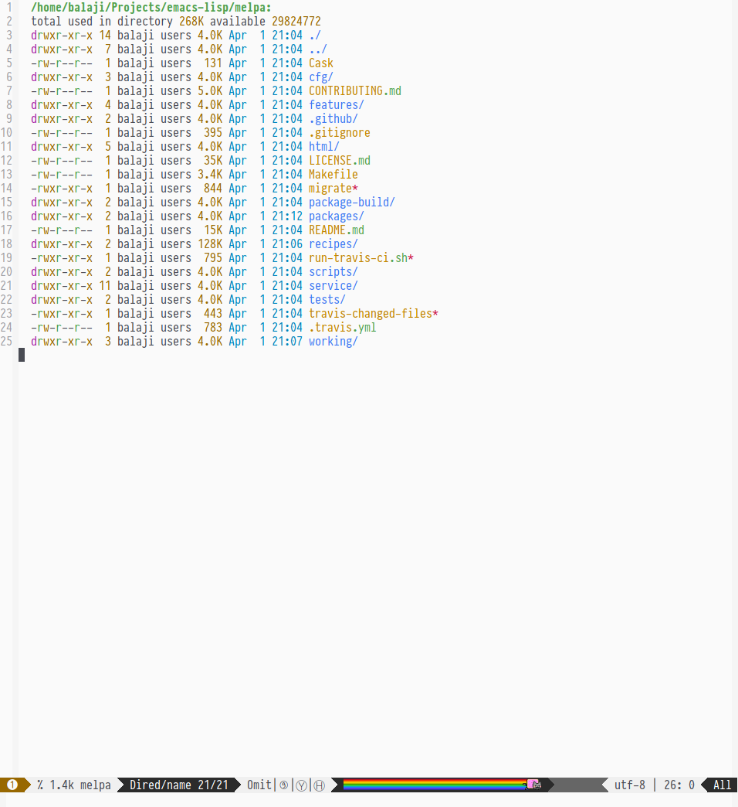
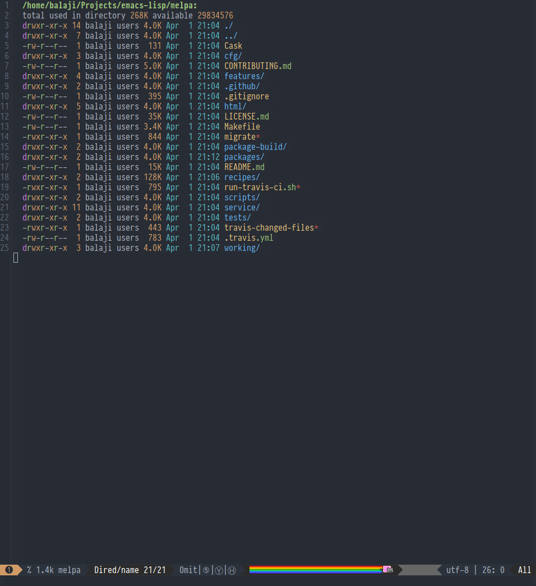
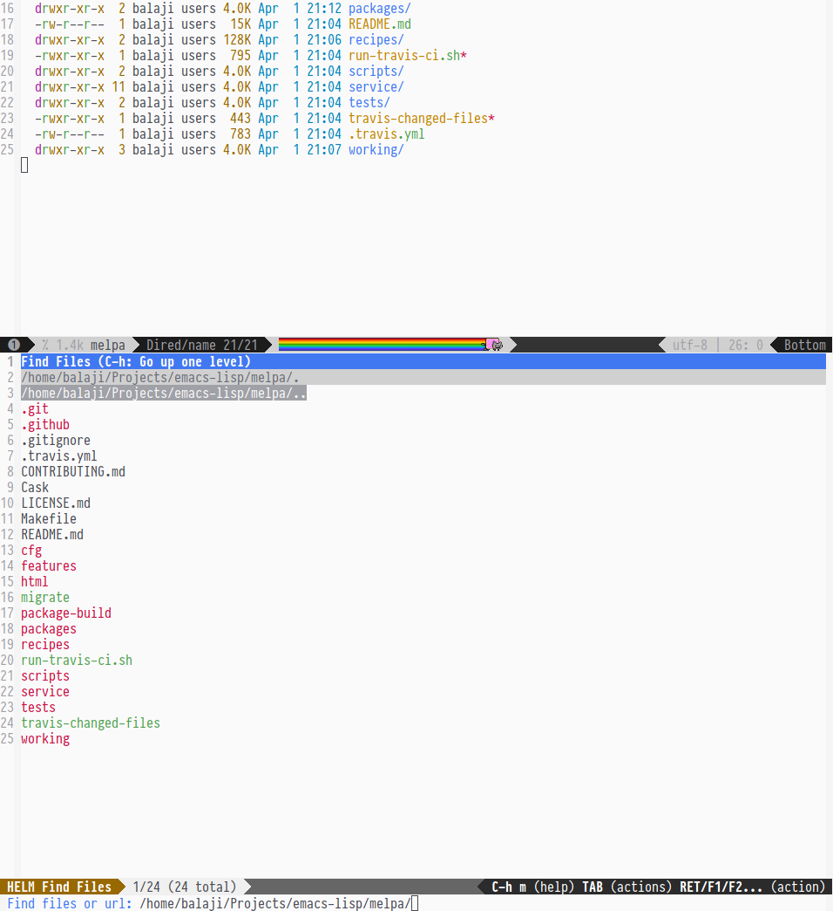
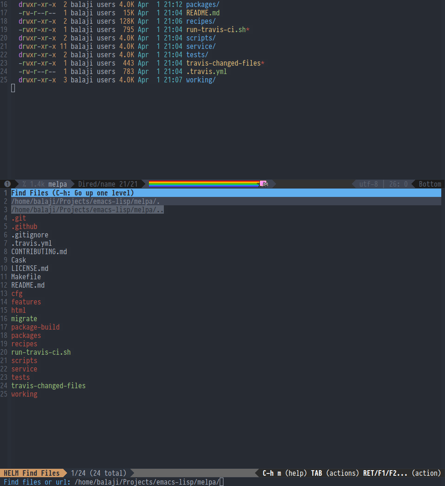
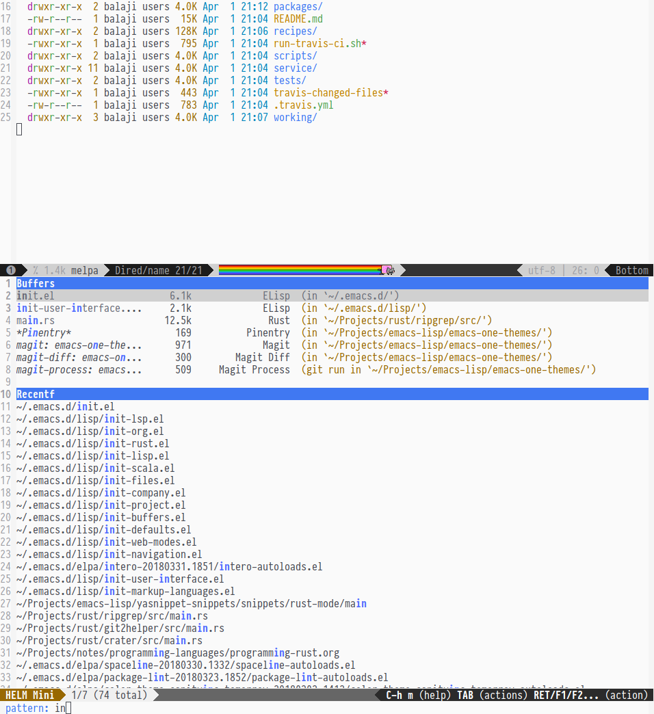
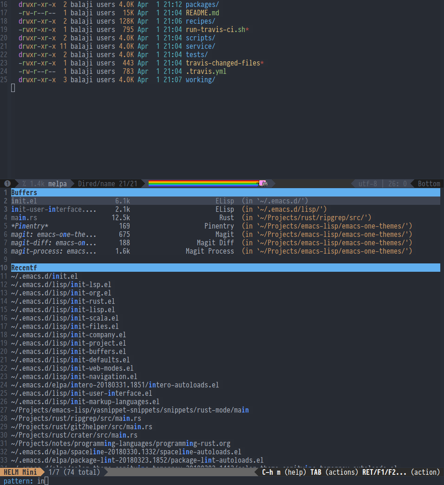
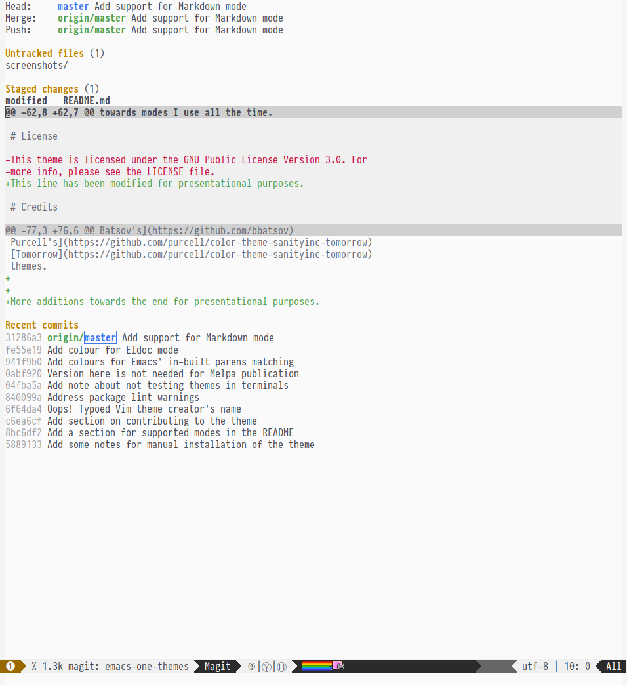
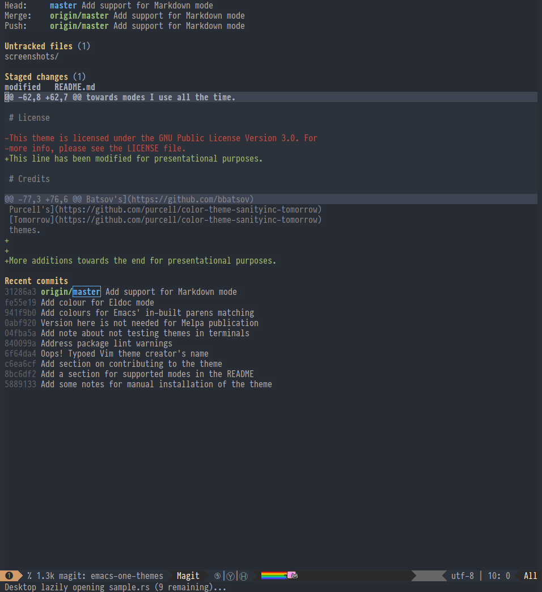
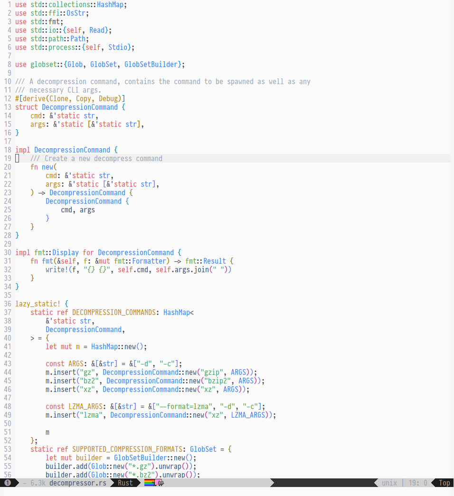
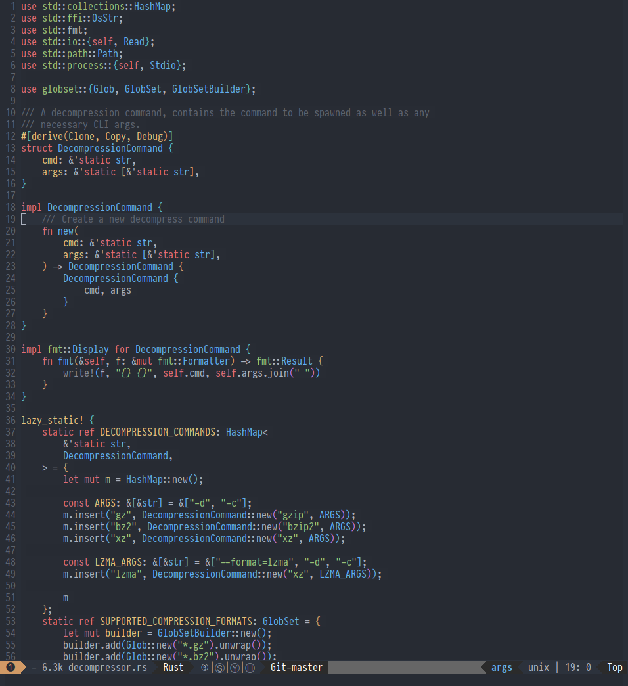

# One for Emacs

[](https://www.gnu.org/licenses/gpl-3.0)
[](https://melpa.org/#/one-themes)

One for Emacs is an Emacs port of the [One theme for
Vim/Neovim](https://github.com/rakr/vim-one/). It provides both the
Dark and Light variants. (Note that the Vim theme itself was a port of
[One Dark](https://atom.io/themes/one-dark-syntax) and [One
Light](https://atom.io/themes/one-light-syntax) syntax themes for the
Atom editor.)

This theme is primarly tested under Emacs 24 or greater, but it should
ideally work Emacs 23 as well. It is also implemented in terms of the
builtin theming support in Emacs 24 or greater and does not provide
support for the older `color-theme-package`.

Also note that I have **not tested** this theme for usage in terminals. I
primarily use Emacs GUI, and that is the environment in which I tested
this theme.

# Installation

## From Melpa using `package.el`

One for Emacs is available via the MELPA `package.el` repository.
Instructions for setting up Melpa can be found
[here](https://github.com/melpa/melpa#usage).

Afterwards, it's simply a matter of doing the following within your
Emacs:

```
M-x package-install one-themes
```

Once installed, you can do:

```
(load-theme 'one-dark t)
```
OR
```
(load-theme 'one-light t)
```

## Using `use-package`

If you have [use-package](https://github.com/jwiegley/use-package)
setup, then you should be able to do the following:

```
(use-package one-themes
  :init
  (load-theme 'one-dark t))
```
OR
```
(use-package one-themes
  :init
  (load-theme 'one-light t))
```

## Manual Installation

Clone this repository to some location on your PC.

```
(add-to-list 'load-path "<clone location>/emacs-one-themes")
(add-to-list 'custom-theme-load-path "<clone location>/emacs-one-themes")
```

Afterwards, you can simply follow the `load-theme` instructions from
above to load the variant of One you want.

# Supported Modes

- Helm
- Ivy
- Magit
- Org
- Dired
- Flycheck
- Markdown
- EDiff
- Company
- Rainbow Delimiters
- Spaceline
- Ledger

And more.

# Screenshots

All the below screenshots use the wonderful [Pragmata Pro](https://www.fsd.it/shop/fonts/pragmatapro/) as the font.

## Dired Mode

<a href="screenshots/dired-light.png">
</a>
<a href="screenshots/dired-dark.png">
</a>

## Helm Find Files Mode

<a href="screenshots/helm-find-files-light.png">
</a>
<a href="screenshots/helm-find-files-dark.png">
</a>

## Helm Find Buffer Mode

<a href="screenshots/helm-find-buffers-light.png">
</a>
<a href="screenshots/helm-find-buffers-dark.png">
</a>

## Magit

<a href="screenshots/magit-light.png">
</a>
<a href="screenshots/magit-dark.png">
</a>

## Rust (Sample for Font Lock Colours)

<a href="screenshots/rust-light.png">
</a>
<a href="screenshots/rust-dark.png">
</a>

# Contributing

This port is very much a work-in-progress. I'm not a visual designer
and have eyeballed colouring of the various faces based on the
original Vim theme, as well as what looks pleasing to me. If you feel
some colours could be improved, I'd happily accept PRs for the same.

If you find modes that are missing colour configurations, please feel
free to contribute the same using PRs. This theme is heavily biased
towards modes I use all the time.

# License

This theme is licensed under the GNU Public License Version 3.0. For
more info, please see the LICENSE file.

# Credits

This theme draws heavily upon the colours and naming specified in [Vim
One](https://github.com/rakr/vim-one/) by [Ramzi
Akremi](https://github.com/rakr/).

Additionally, the design of this Emacs port is inspired by [Bozhidar
Batsov's](https://github.com/bbatsov)
[Solarized](https://github.com/bbatsov/solarized-emacs) and [Steve
Purcell's](https://github.com/purcell/color-theme-sanityinc-tomorrow)
[Tomorrow](https://github.com/purcell/color-theme-sanityinc-tomorrow)
themes.
